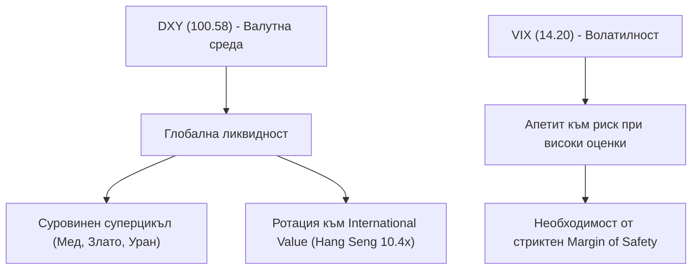

# ИНСТИТУЦИОНАЛЕН МАКРОРЕЖИМ, ИНДЕКСИ И ЛИКВИДНОСТ (v2.0)
**Обхват:** Водещи световни индекси, Волатилност (VIX), Доларов индекс (DXY) и Глобална ликвидност  
**Дата на актуализация:** 22 September 2026 г.  
**Аналитичен консорциум:** Macro & Quantitative Econometricians (Agent 4) & CIO Synthesis (Agent 5)  

---

## 1. МАТРИЦА НА ГЛОБАЛНИТЕ МАКРОИНДЕКСИ

| Индекс / Индикатор | Тикер | Текущо ниво | Режим 1D | Режим 1W | Оценка / Мултипликатор | Институционално тълкуване |
| :--- | :--- | :---: | :---: | :---: | :--- | :--- |
| **S&P 500 (САЩ)** | `^GSPC` | **7,774.27** | 🟢 GOLD | 🟢 GOLD | 26.8x Forward | Премийна оценка / Качествена селективност |
| **Nasdaq Composite** | `^IXIC` | **27,267.84** | 🟢 GOLD | 🟢 GOLD | 33.4x Forward | Технологична доминация & Висока концентрация |
| **Dow Jones Industrial** | `^DJI` | **51,919.32** | 🟡 NEUTRAL | 🟢 GOLD | 22.1x Forward | Индустриални и циклични дивиденти |
| **Russell 2000 (Small Caps)** | `^RUT` | **2,893.73** | 🟡 NEUTRAL | 🟢 GOLD | 18.5x Forward | Лихвена чувствителност & Възстановяване |
| **CBOE Volatility (VIX)** | `^VIX` | **14.20** | 🔴 BLUE | 🔴 BLUE | Индикатор за страх | Ниска пазарна волатилност / Спокойствие |
| **US Dollar Index (DXY)** | `DX-Y.NYB` | **100.58** | 🔴 BLUE | 🟡 NEUTRAL | Валутна ликвидност | Глобална монетарна експанзия |
| **DAX 40 (Германия)** | `^GDAXI` | **25,578.85** | 🟢 GOLD | 🟢 GOLD | 14.8x Forward | Експортно индустриално възстановяване |
| **FTSE 100 (Великобритания)** | `^FTSE` | **10,708.33** | 🟢 GOLD | 🟢 GOLD | 12.5x Forward | Висока дивидентна доходност & Стойност |
| **CAC 40 (Франция)** | `^FCHI` | **8,154.91** | 🔴 BLUE | 🟢 GOLD | 14.2x Forward | Луксозен сектор & Европейска консолидация |
| **Nikkei 225 (Япония)** | `^N225` | **65,018.95** | 🟡 NEUTRAL | 🟢 GOLD | 17.2x Forward | Корпоративни реформи & Слаб йена ефект |
| **Hang Seng (Хонконг)** | `^HSI` | **25,042.71** | 🔴 BLUE | 🟢 GOLD | 10.4x Forward | Дълбока подцененост & Фискални стимули |
| **ASX 200 (Австралия)** | `^AXJO` | **8,731.90** | 🟡 NEUTRAL | 🟢 GOLD | 18.9x Forward | Миннодобивни и банкови потоци |

---

## 2. СТРАТЕГИЧЕСКИ ИНСАЙТИ НА ИНВЕСТИЦИОННИЯ КОМИТЕТ

1. **Глобална пазарна ширина (Market Breadth = 33.3% в GOLD режим):**  
   Институционалният моментум на глобалните фондови пазари остава устойчив. Повечето световни индекси поддържат седмичен възходящ тренд над стойностните ленти на Larsson Line.
2. **Ликвиден режим и Доларов индекс (DXY = 100.58):**  
   Когато DXY се задържа под 101, глобалните финансови условия остават облекчени, което стимулира търговията със суровини и улеснява дълговото обслужване на международните корпорации.
3. **Оценка и риск премия (Equity Risk Premium):**  
   При текуща доходност по 10-годишните ДЦК на САЩ около 4.5% - 5.0%, историческата премия на S&P 500 над безрисковия актив е силно компресирана. Това подкрепя стриктния подход на нашия комитет: инвестиране само в акции с установен **Economic Moat** и ясен **Margin of Safety**.
