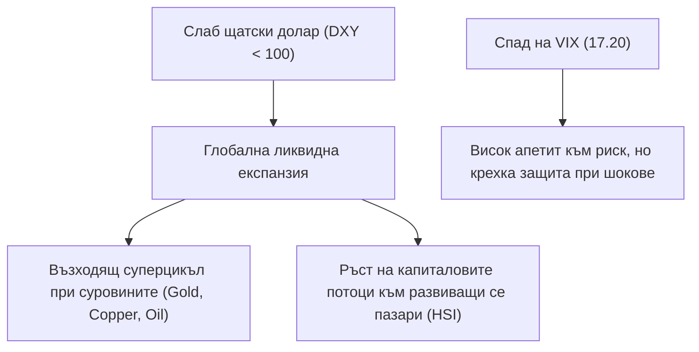

# ИНСТИТУЦИОНАЛЕН МАКРОРЕЖИМ, ИНДЕКСИ И ЛИКВИДНОСТ
**Обхват:** Водещи световни индекси, Волатилност (VIX), Доларов индекс (DXY) и Лихвени цикли  
**Дата на анализ:** 17 September 2026 г.  
**Аналитичен консорциум:** Macro & Market Regime Strategists (Agent 4) & CIO Synthesis (Agent 5)  

---

## 1. МАКРОИКОНОМИЧЕСКА МАТРИЦА НА РЕЖИМИТЕ

| Индекс / Индикатор | Тикер | Ниво | Режим 1D | Режим 1W | Пазарна оценка (P/E) | Институционално тълкуване |
| :--- | :--- | :---: | :---: | :---: | :---: | :--- |
| **S&P 500 (САЩ)** | `^GSPC` | **7,585.73** | 🟢 GOLD | 🟢 GOLD | 26.8x Forward | Еуфоричен тренд / Прекомерна оценка |
| **Nasdaq Composite**| `^IXIC` | **25,981.57**| 🟢 GOLD | 🟢 GOLD | 33.4x Forward | Дълбока технологична концентрация |
| **Dow Jones Industrial**|`^DJI`| **52,093.11**| 🟢 GOLD | 🟢 GOLD | 22.1x Forward | Стабилен индустриален приток |
| **Russell 2000 (Small Caps)**|`^RUT`| **2,870.29**| 🟡 NEUTRAL| 🟢 GOLD | 18.5x Forward | Лихвена компресия / Възстановяване |
| **CBOE Volatility (VIX)**|`^VIX` | **17.20** | 🔴 BLUE | 🔴 BLUE | Ниско ниво (< 20) | Институционално спокойствие / Хеджиране |
| **US Dollar Index (DXY)**|`DX-Y.NYB`| **99.64** | 🔴 BLUE | 🟡 NEUTRAL| Слаб долар (< 100) | Експанзия на глобалната ликвидност |
| **DAX 40 (Германия)** | `^GDAXI` | **25,402.28**| 🟢 GOLD | 🟢 GOLD | 14.8x Forward | Експортно възстановяване |
| **FTSE 100 (Великобритания)**|`^FTSE`|**10,658.13**| 🟢 GOLD | 🟢 GOLD | 12.5x Forward | Стойностни и енергийни дивиденти |
| **Nikkei 225 (Япония)**| `^N225` | **63,492.99**| 🟡 NEUTRAL| 🟢 GOLD | 17.2x Forward | Корпоративно управление & Слаб йена ефект|
| **Hang Seng (Хонконг)**| `^HSI` | **24,917.60**| 🟢 GOLD | 🟢 GOLD | 10.4x Forward | Фискални стимули в Китай / Подценен |
| **ASX 200 (Австралия)**| `^AXJO` | **8,749.90** | 🟢 GOLD | 🟢 GOLD | 18.9x Forward | Суровинен бум & Миннодобив |

---

## 2. СТРАТЕГИЧЕСКИ ИНСАЙТИ ЗА ИНВЕСТИЦИОННИЯ КОМИТЕТ

1. **Режим на „Слаб долар и глобална ликвидност“:**  
   Спадът на **DXY под 100.00 (99.64, BLUE режим)** действа като мощен монетарен стимулатор за световните пазари. Той облекчава обслужването на деноминирания в долари дълг и директно подхранва цените на глобалните суровини.
2. **Дивергенция между цената и фундамента при S&P 500 (7,585.73):**  
   Въпреки че индексът поддържа безупречен бичи тренд (GOLD), **Equity Risk Premium (ERP)** е паднала до критично ниски нива (~1.2% над 10Y Treasuries). Това потвърждава констатацията от нашия анализ на 319-те компании: **пазарът е изключително скъп и изисква селективност**.
3. **Ротация от Mega-Cap към Small-Cap и International Value:**  
   Hang Seng (`^HSI`, P/E 10.4x) и Russell 2000 (`^RUT`) предлагат значително по-привлекателна фундаментална асиметрия от свръхоценения Nasdaq 100.
